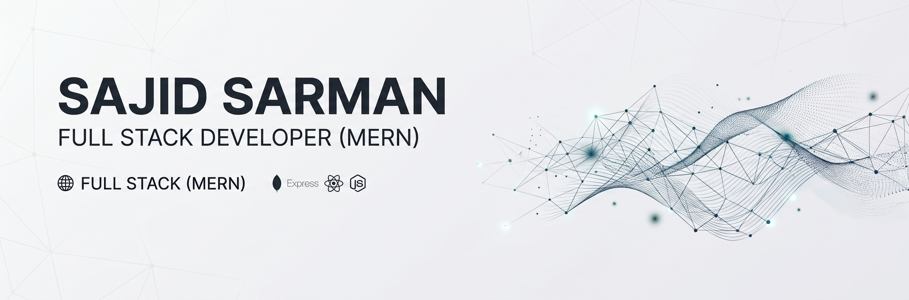

  

# Hi, I'm Sajid Sarman [^ ^] 👋

### Full-Stack Developer in Progress | MERN Stack | Linux Enthusiast

---

## ./ About Me 👨‍💻

I'm a developer currently learning **full-stack web development with the MERN stack**. I enjoy building web applications, working with Linux, and exploring how systems work behind the scenes.

I'm also interested in **cybersecurity** and enjoy experimenting with Linux and different technologies. Outside of web development, **game development is one of my hobbies**.

* Currently learning **MERN Stack & Next.js**
* Building projects to improve my **full-stack development skills**
* Comfortable working with **Linux**
* Exploring **Cybersecurity**
* Hobby **Game Development**

---

## ./ Skills & Technologies 🛠️

### Frontend

  

### Backend & Database

  

### Tools & Environment

  

### Exploring

  

---

## ./ Connect With Me 🤝

  

  

  

---

## ./ GitHub Stats 📊

  

---

## ./ Featured Projects 🚀

### > FitLog 💪

A fitness-focused web application for discovering and managing workout exercises.

**Tech:** Next.js, TypeScript, React, Tailwind CSS

🔗 [Live Demo](https://fitlog-b14-a06-s-sarman.vercel.app/)
📂 [Repository](https://github.com/SajidSarman/b14-a06)

---

### > DevStack 💻

A technology stack explorer that allows users to browse technologies and build their ideal development stack.

**Tech:** React, TypeScript, Tailwind CSS

🔗 [Live Demo](https://devstack-s-sarman-b14-a05.netlify.app/)
📂 [Repository](https://github.com/SajidSarman/B14-A05)

---

  thanks for your valuable time.

